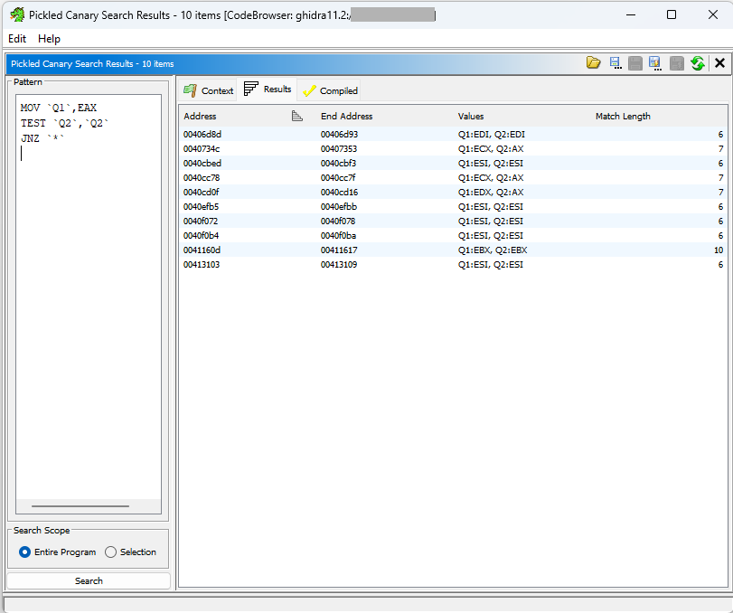
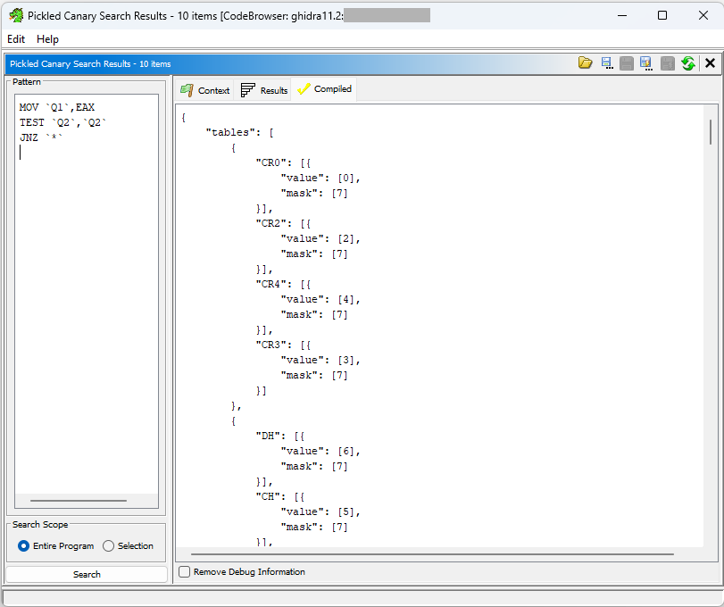
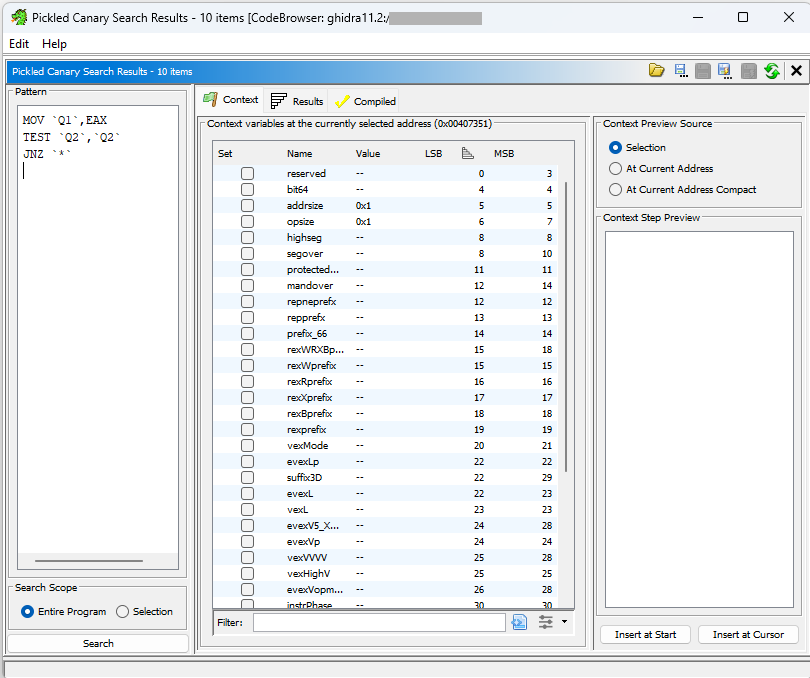

# Pickled Canary

**Assembly-based binary pattern search!**


- Start with a known vulnerability and known vulnerable binary (or even better,
  binaries).
- Capture the vulnerability behavior in an [assembly-language-based
  pattern](#pattern-language).
- Compile the pattern using our [Ghidra plugin](#ghidra-plugin).
  - This translates assembly into an [efficient binary
    format](#compiled-pattern-language), which encompasses all the possible
    binary encodings for each instruction.
- Use our [Rust search tool](#rust-search-tool) to quickly find the pattern in
  many binaries!
  - Alternatively, use our [Python library](#python-library).
  - Additionally, you can search directly in the [Ghidra plugin](#ghidra-plugin)
    as well!

# Repository Structure

This repository contains all aspects of Pickled Canary including:

- The Ghidra plugin
- The Rust search tool—with Python bindings

The location and installation instructions for each of these are described in
their respective sections below.

A summary of the top-level directories of this repository follows:

- `docs/` - directory for the images in this README
- `example_patterns/` - example Pickled Canary patterns that can be used to find
  the existence or non-existence of specific CVEs in binaries
- `ghidra_scripts/` - Ghidra scripts that can be used to run the Pickled Canary
  compiler and search tools
- `lib/` - required libraries needed to run the Java portion of Pickled Canary
- `search/` - source code for the Rust search tool and the Python wrapper around
  the Rust search tool
- `src/` - Java source code for the Ghidra plugin containing the pattern
  compiler and Java search tool

# Ghidra Plugin

## Download

Download the ZIP file on the Releases page. The ZIP file contains Ghidra
extensions for several versions of Ghidra.

## Install

Install just like any other Ghidra extension:

1. Click `File` > `Install Extensions...`.
1. Click the green plus sign, and choose the Pickled Canary Ghidra extension
   for your version of Ghidra.
1. Make sure the checkbox next to the new extension is checked.
1. Restart Ghidra.

## Run

The Pickled Canary Ghidra plugin can be run via the [GUI](#gui) or via [Ghidra
scripts](#ghidra-scripts).

### GUI

With the Pickled Canary Ghidra plugin installed, a `Search` > `Pickled Canary Pattern`
menu option is available.

> **Tip:** Selecting a range of instructions in the listing view before opening
> the GUI will pre-populate those instructions into the pattern input box.



Enter a pattern on the left side of the GUI and then press `Ctl-Enter`, the
 reload icon, or the Search button to
compile and search for the pattern. Results are listed in the table on the
right side. Selecting a result will jump to that address in the binary.

An existing pattern can be loaded into the GUI using the
 open icon, and an edited pattern
can be saved using the Save () or Save As
() icons.



The "Compiled" tab shows the JSON encoding of the currently compiled pattern
(use `Ctl-Enter` in the pattern editor to recompile the pattern). The "Save
Compiled Pattern As" () or "Save Compiled Pattern" ()
buttons can be used to save the compiled pattern to a JSON file for use in the
[Rust search tool](#rust-search-tool).

> **Tip:** Ensure the pattern has finished compilation (no more progress bar
> shown under the "Results" tab) before saving the compiled pattern.



The "Context" tab shows the [context variables](#context) at the address of the
cursor. The table shows the name, the value (`--` means there is no value), and
the bit locations of the context variable within the context register (where
"LSB" is the first bit of the variable and "MSB" is the last bit of the
variable). The "Set" field and the rightmost panel can be used to insert context
constraints into the pattern.

### Ghidra Scripts

There are two included Ghidra scripts, both of which are available in Ghidra's
script manager:

1. `AssembleAndRunPattern` - Compiles a pattern and executes it within Ghidra,
   highlighting matches
1. `AssemblePattern` - Compiles a pattern for execution in the [Rust search
   tool](#rust-search-tool)

> **Tip:** These scripts can be copied/modified to behave differently (e.g., to
> add bookmarks to each match rather than highlighting).

## Uninstall

To uninstall the current Pickled Canary extension (to install a new version, for
example):

1. Click `File` > `Install Extensions...`.
1. Uncheck the box next to the "PickledCanary" extension.
1. Restart Ghidra.

If the extension still seems to be installed:

1. Ensure that Ghidra is not running (AT ALL).
1. Delete the "pickled-canary" folder (may have a variation of this name) in:
   - Windows: `C:\Users\USERNAME\AppData\Roaming\ghidra\GHIDRA_VERSION\Extensions\`
   - Linux: `~/.ghidra/GHIDRA_VERSION/Extensions/`

## Ghidra Development Setup

Requirements:

- An existing installation of Ghidra v11.1 or newer
- JDK 17 or newer (Ghidra v11.2 or newer require a minimum of JDK 21)
- Gradle 8.0 or newer

#### Development with Eclipse

1. Clone this repository.
1. If you were previously developing outside of Eclipse, `rm -rf` the `build/` directory.
1. Generate the ANTLR derived source code by running: `gradle generateGrammarSource`.
1. Open Eclipse (with [GhidraDev](https://github.com/NationalSecurityAgency/ghidra/blob/master/GhidraBuild/EclipsePlugins/GhidraDev/GhidraDevPlugin/README.md) already installed).
1. In Eclipse, click `File` > `Open Projects from File System...`, chose the
   cloned copy of this repository, and click `Finish`.
1. In the Eclipse `Package Explorer`:
   1. Right click on the newly created project, choose `GhidraDev` > `Link
Ghidra...`, and choose your Ghidra installation.
   1. Right click on `lib` > `json-20230618.jar` and choose `Build Path` > `Add
to Build Path`.
   1. Right click on `lib` > `antlr4-runtime-4.13.1.jar` and choose
      `Build Path` > `Add to Build Path`.
   1. Right click on `src/test/java` and choose `Build Path` > `Use as Source
Folder`.
   1. Right click on `src/test/resources` and choose `Build Path` > `Use as Source
Folder`.
   1. Right click on `generated-src/antlr/main/java` and choose `Build Path` >
      `Use as Source Folder`.
1. To run the code, click the green run button and select "Ghidra" as the run
   configuration, then click "OK".

#### Development without Eclipse

1. Clone this repository.
2. Set the `GHIDRA_INSTALL_DIR` environment variable to the path of the Ghidra
   installation on your computer.
3. Import the directory into to your favorite Java IDE as a Gradle project.
   Make sure to set the `GHIDRA_INSTALL_DIR` environment variable for any run
   configurations you add.
4. To build the extension, run the `buildExtension` Gradle task (i.e. `gradle
buildExtension`).
5. The compiled extension will be created at `dist/ghidra_%VERSION%_PUBLIC_%DATE%_pickled-canary.zip`.
6. Follow the installation instructions above to install the new extension
   file.

# Rust Search Tool

The Rust search tool consists of a library containing an automata for
processing our [DFA](#compiled-pattern-language) and a wrapper binary that
uses this library to search one or more binary files for provided patterns.
This tool is more performant than the Java search tool, and it can search
multiple binaries at once.

The name of the tool is `treesearchtool`. It can be compiled with the nightly
Rust compiler, and more help on specific options is available by running with
`-h`.

**TODO:** More documentation about the specifics of this tool (once it's
finalized a bit more).

## Download

The pre-built `treesearchtool` binary is located in the ZIP file found on the
Releases page. Once the file is unzipped, open the `pickled_canary_rust_tools/`
directory to find the search tool. The search tool used should be from the same
release as was used to compile your patterns.

# Python Library

The Pickled Canary Python library wraps a Rust library, which exposes the core
search behavior of Pickled Canary.

## Usage

After installing (see below), simply do something like:

```python
from pickled_canary import PatternOffsetResults
pattern_str = """{"tables":[],"steps":[{"type":"BYTE","value":116},{"type":"BYTE","value":102},{"type":"BYTE","value":116},{"type":"BYTE","value":112},{"type":"BYTE","value":95},{"type":"BYTE","value":114},{"type":"BYTE","value":120},{"type":"MATCH"}]}"""
test_data = b"aaatftp_rxddtftp_rxasdfasdf"

# Results is a list of offsets into the test_data binary where pattern_str matched
results = list(PatternOffsetResults.create_and_run(pattern_str, test_data))
```

If you don't want to pre-search the entire target binary, you can use the
following code to search one result at a time:

```python
from pickled_canary import LazyPatternOffsetResults
pattern_str = """{"tables":[],"steps":[{"type":"BYTE","value":116},{"type":"BYTE","value":102},{"type":"BYTE","value":116},{"type":"BYTE","value":112},{"type":"BYTE","value":95},{"type":"BYTE","value":114},{"type":"BYTE","value":120},{"type":"MATCH"}]}"""
test_data = b"aaatftp_rxddtftp_rxasdfasdf"

lazy = LazyPatternOffsetResults.create_pattern(pattern_str, test_data)
first_result = next(lazy)
# Note that the following line continues the search starting from the next byte after the offset of first_result
second_result = next(lazy)
# etc...
```

## Library Installation

For non-development work on Linux, you can download and install a pre-built
wheel matching your Python version from the Releases page (**Coming soon**).

You can try the "manylinux" version (from the same download location) if the
shorter filename version doesn't work.

For Windows or Mac computers with "Apple Silicon", please follow the
Development instructions below.

## Development

Follow these instructions to be able to modify the Python code and use the most
current Rust code (in your workspace) from the Python library.

> **NOTE:** You will likely want to make sure you have a virtual environment of
> some sort set up and in use for this.

In the `search/` directory, run `pip install --editable .`.

If you modify the Rust code, you will need to rerun this pip command so the
Rust code is recompiled and relinked against the Python code (you do not need
to do this for modifications to the Python code).

There are some simple test cases available by running `pytest` (assuming you
have pytest installed, else first run `pip install pytest`).

For more information, see the [Python README](search/README_python.md).

# Pattern Language

Examples of our pattern language are available in the `example_patterns/`
directory in this project. Pattern files end in a `.ptn` extension.

Leading whitespace is always ignored.

## Comments

Lines starting with `;` are considered comments and no further processing is
performed on them.

## Metadata

Exactly one metadata block may be included in each pattern. This block is used
to document information about the pattern in a programmatically understandable
way.

The meta block starts with `` `META` `` alone on a line. The meta block ends
with another `` `META` `` alone on a line. Between these two lines is a JSON
object (e.g., `{ "key": "value", "key2": 2 }`). Additionally, there may be
comment lines (starting with `;`, as usual), which are removed before the meta
block is parsed as JSON.

## Command Blocks

Command blocks are special commands to Pickled Canary that go beyond basic
assembly syntax to provide advanced searching capabilities.

All command blocks are surrounded by backtick characters; e.g.,
`` `SOMETHING` ``.

Command blocks should be included on their own line in the pattern (unless
otherwise specified).

### Specific Byte

Matches the given hex byte.

`` `=0xXX` `` where `XX` is the hex representation of a byte.

It can also match a given string's respective ASCII bytes. This can be done by
enclosing the string in double quotes.

**Example:** `` `"string 1"` `` attempts to match the bytes `0x73 0x74 0x72
0x69 0x6E 0x67 0x20 0x31`.

### Masked Byte

Performs a logical AND on the byte being examined and the given mask. Compares
the result to the given byte value. Matches if the masked value matches the
given byte value.

`` `&0xXX=0xYY` `` where `XX` is the mask and `YY` is the value to compare the
masked search byte against.

**Example:** `` `&0x0F=0x8` `` creates a match if `byte_being_examined & 0x0F
== 0x8`.

### Any Byte

Matches some number of bytes regardless of the bytes' value(s).

`` `ANY_BYTES{MIN,MAX,INTERVAL}` `` where `MIN` is the minimum number of bytes
to match, and `MAX` is the maximum number of bytes to match (inclusive). `MIN`
and `MAX` can be the same number to match that specific number of bytes.
`INTERVAL` is the number of bytes stepped in each iteration. It is an
**optional** argument, and its default value is 1.

**Examples:**

- `` `ANY_BYTES{2,5,1}` `` can also be written as `` `ANY_BYTES{2,5}` ``.
- `` `ANY_BYTES{3,7,3}` `` steps through the range of (3,7) bytes in intervals
  of 3, meaning Pickled Canary will search for the next instruction at 3 bytes
  and 6 bytes after the end of the previous instruction.

### OR Blocks

OR blocks allows one of multiple choices to be matched.

OR options are evaluated in the order they are written in the pattern
(top-down). **Performance tip: Make sure the option that is most likely to fail
or match fastest is placed in the first option of an OR block.**

Start the OR block with `` `START_OR {` `` then include
[instructions](#instructions) or [command blocks](#command-blocks) as usual. At
the end of the first option, add a `` `} OR {` `` followed by the second set of
[instructions](#instructions) or [command blocks](#command-blocks). Another
`` `} OR {` `` can be added followed by an additional option, and so on.
Finally, end with an `` `} END_OR` ``.

For example, the following pattern matches `0xAA` followed by either `0xBB
0xCC` or `0x01 0x02` (remember, leading whitespace does not matter):

```
`=0xAA`
`START_OR {`
  `=0xBB`
  `=0xCC`
`} OR {`
  `=0x01`
  `=0x02`
`} END_OR`
```

### Wildcards

Wildcards are used to indicate that more than one value (register, constant,
etc.) is allowable for a specific operand in an instruction.

Wildcards are included inline within an [instruction](#instructions) (see
examples below).

#### Wildcard Tokens

By default, Ghidra's instruction parser first groups the characters of an
instruction line into tokens; it then attempts to match each token against a
list of possible "expected" tokens. These "expected" tokens are limited to the
tokens that are valid in this position within the current instruction.

We have worked with the Ghidra team to modify Ghidra's instruction parser to
think that a Pickled Canary "wildcard" token matches all the "expected" tokens
for the step where they are encountered. This means a single Pickled Canary
wildcard matches a single token.

To get an idea of what a token is Ghidra's autocompleter can be consulted. To
manually exercise the autocompleter, right-click on an instruction in the
listing view and choose "Patch Instruction". From there, you can edit the
instruction and notice the suggestions provided. Each suggestion represents a
complete token (assuming you haven't already partially typed the token; if so,
only the remaining portion of the token is shown).

#### Wildcard Field vs Scalar

A wildcard token can be either a "field" type or a "scalar" type. A "field"
type is replaced with a limited set of values, typically registers. A "scalar"
type is replaced with a number or a label representing a number (most likely in
the form of an address or immediate value).

#### Wildcard Format

A Pickled Canary wildcard consists of a `NAME` and a `FILTER` in the format
`` `NAME/FILTER` `` where:

- `NAME` is an identifier (also occasionally called a "variable" or "label")
  for this wildcard and is used to save the value it represents.
  - Traditionally, this is something like `Q1`, but it can also be something
    more descriptive.
  - If a name is repeated multiple times within the same pattern, then all
    instances of that name must contain the same value (e.g., register, number,
    etc) for the pattern to be a match.
    - Subsequent uses of a name MUST NOT specify a `FILTER`. In subsequent uses
      of a name, the `FILTER` value is reused from the first use of the name.
  - **TODO:** If `NAME` is `*`, no value will be saved by the Rust code, nor
    will this `NAME` be matched against any other wildcards named `*`.
    - Actually, no extracting of the value will even be performed in Rust,
      making this faster than if a unique name was specified.
      - A unique name may still be desirable if the value of the wildcard is
        important to extract.
    - It is still possible to specify a `FILTER` for a `*` wildcard as all
      possible completions are still enumerated because they may impact overall
      instruction encoding.
- `FILTER` is an expression that can take two forms:
  - A regular expression that must match for every acceptable token value of
    the wildcard.
    - When a filter is specified, Ghidra's "expected" tokens are filtered to
      include tokens that match only the `FILTER` regular expression.
    - Examples:
      - `.*` to match any value
      - `r[0-9]` to match only registers `r0` through `r9`.
    - This type of filter does NOT apply on numeric values of a wildcard.
  - A bracketed, comma-separated, set of ranges specifying valid numeric values
    for a wildcard.
    - Examples:
      - `[0..10]` to match the numeric values 0 through 10.
      - `[-0x4..0x4,10..20]` to match the numeric values -4 through 4 or 10
        through 20.
      - `[..]` to match all numeric values (but not register or other
        string-specified values).
  - NOTE: Starting in v0.1.0 filters must be separately specified for each
    instance of a wildcard. In other words, filters are no longer inherited
    from the first use of a given wildcard name. This is mostly important for
    search performance where it is likely best to specify filters as often as
    possible.
- Only `NAME` is required (although it may be `*`).

#### Address Wildcards

If a wildcard's label starts with a `:` character and it is found to be used as
a scalar in an instruction, Pickled Canary will attempt to compute the address
encoded by the scalar and report/match on that address.

For example, a MIPS `beq` instruction encodes a branch destination as its final
operand. To branch to eight instructions ahead of the `beq` instruction, a
binary `6` is encoded into the instruction. This is because MIPS specifies that
the branch destination is calculated as: `((Current branch instruction
address)+4)+((encoded value)*4)`. Given this, if the wildcard for the branch
destination operand is specified in Pickled Canary with a label starting with
`:`, then Pickled Canary will calculate this label as an address yielding a
value of the `beq`'s address plus 28.

This feature can be used in conjunction with [Labels](#labels) to enforce a
constraint on the scalar value of a wildcard (e.g., the destination of a
branch). For example, the following pattern will match on `beq` instructions
that branch only to a specific `sw` instruction and must occur within 40
bytes of the `beq`.

```
beq a0,zero,`:mylabel`
`ANY_BYTES{0,40}`
`mylabel:`
sw zero,0x104(s2)
```

> [!WARNING]
>
> If the math required to compute the value of a label in an instruction
> involves computation based on an address (say the start or end address of the
> current instruction), Pickled Canary may produce an unexpected result if the
> alignment of the matched bytes does not match the expected alignment of the
> instruction in an executing binary.
>
> For example, if an architecture assumes that an instruction will be four-byte
> aligned when executing but the instruction is found on another alignment by
> Pickled Canary (perhaps because of an oddly-sized file header proceeding the
> instruction), the calculation of the address referenced by that instruction
> may be incorrect.
>
> The only known way to avoid this issue is to ensure that the binary being
> searched is aligned in the file the same way it is expected to be running.

### Context

> [!WARNING]
>
> This version of Pickled Canary has a partial version of context support! If
> unspecified, context defaults to 0, just as Ghidra's initial disassembler
> defaults to 0. A version of Pickled Canary supporting unspecified context is
> in the works (and likely requires core Ghidra updates) but not yet ready for
> widespread use.

Ghidra uses the concept of "context" in various ways in its assembler and
disassembler. Generally, it's a way to record state about the system that is not
memory or a traditional register. Concretely, context in Ghidra is represented
as a register, which is subdivided into smaller named registers. As an example,
Ghidra uses a `ISA_MIPS` context register to distinguish between MIPS and MIPS16
modes on a MIPS32 processor. Similarly, a `TMode` register distinguishes between
ARM Thumb and non-Thumb modes.

By default, Pickled Canary will generate patterns encompassing all possible
context values for the first instruction, and then ensure that subsequent
instructions do not have conflicting context requirements. For example, the
first instruction in an ARM pattern may produce a pattern that could match
either Thumb or non-Thumb encodings. Depending on which encoding is found in a
binary, subsequent instructions will match the mode of the first-matched
instruction.

There are several limitations with Pickled Canary's ability to work with context:

- Pickled Canary has a limited ability to reflect, enforce, and verify context
  changes that do not occur on the next instruction.
- Pickled Canary has no concept of what context changes may or may not occur in
  bytes matched with non-instruction commands (such as [Specific
  Byte](#specific-byte), [Any Byte](#any-byte), etc...).

Pickled Canary provides a special syntax to place constraints on which
instruction encodings are considered possible based on setting context before an
instruction. This can also be used to adjust expected context after an
instruction or after non-instruction commands.

`` `CONTEXT NAME=VALUE` `` where `NAME` is a context variable name
and `VALUE` is a valid value for that variable specified as:

- A decimal value `Z` where `Z` is some number of decimal digits
- A hex value `0xZ` where `Z` is some number of hexadecimal digits
- A binary value `0bZ` where `Z` is some number of binary digits
- A quoted masked value in Ghidra's `AssemblyPatternBlock` syntax `"Z"` where
  `Z` is a space separated sequence of:
  - `AB` where `A` and `B` are:
    - Hex nibble digits OR
    - The character `X` for an unspecified nibble IR
    - `[CCCC]` where C is either:
      - A binary `1` or `0`
      - A `x` for an unspecified bit

Multiple context variables and values can be specified in a single `CONTEXT`
block by separating the values with a `;` character or newlines.

Examples:

- `` `CONTEXT TMode = 1` `` Ensures only Thumb encodings are
  considered valid for the next instruction in an ARM pattern.
- `` `CONTEXT TMode = "X"` `` Ensures both Thumb and non-Thumb
  encodings are considered valid for the next instruction in an ARM pattern.
- `` `CONTEXT VAR_A = "d1 [x010]5"` `` Ensures the fictitious
  "VAR_A" context variable is set to 0xd1a5 or 0xd125 for the next instruction
- `` `CONTEXT VAR_A = "7X X5"` `` Ensures the fictitious "VAR_A" context
  variable is set to a value with 7 in the first nibble, and a 5 in the last
  nibble.
- `` `CONTEXT VAR_A=1 ; VAR_B = 2` `` Ensures that the fictitious "VAR_A" and
  "VAR_B" context variables are set to 1 and 2 (respectively) for the next
  instruction.

> [!WARNING]
>
> There are a few cases where Pickled Canary is not able to detect the context
> changes of an instruction because of how the changes are specified by Ghidra.
> Pickled Canary detects context changes based on the sleigh specification. Any
> changes specified elsewhere will not be applied.
>
> For example, the `blx` instruction in ARM will not have its context changes
> applied when compiling a pattern because the changes are specified in
> Ghidra's ARM analyzer instead of the sleigh specification.
>
> This issue can be remedied by manually specifying the context in the pattern.

### Negative Lookaheads

> **This is an advanced feature that _severely_ impacts performance and may
> not be supported on all platforms. It is almost always possible to avoid
> using this feature!**

> The Ghidra plugin can parse and compile patterns with this feature. However,
> it cannot currently search for patterns with this feature.

Negative lookahead blocks prevent a match from being found if the pattern
elements inside them are found. They can be used to ensure that a value is not
followed by some other value.

Negative lookahead blocks start with a `` `NOT {` `` and end with a
`` `} END_NOT` ``.

Negative lookaheads must not be used at the very start of a pattern.

Example: The following pattern matches `0x44` followed by any two bytes except
`0x08 0x34` (in that order) followed by a `0x72`. Notice that the
`` `ANY_BYTES{2,2}` `` is needed to match the two bytes because the negative
lookahead block does not "consume" what it tries to match.

```
`=0x44`
`NOT {`
    `=0x8`
    `=0x34`
`} END_NOT`
`ANY_BYTES{2,2}`
`=0x72`
```

### Labels

`` `SOME_LABEL:` `` where `SOME_LABEL` is a user-specified label, the offset of
which will be reported in the pattern output.

> **Tip:** It is best to stick to alphanumeric labels with underscores to avoid
> collisions with other Pickled Canary commands (present or future).

## Instructions

Anything other than a [Command Block](#command-blocks), [Metadata
Block](#metadata), or [Comment](#comments) is considered part of an instruction
and is passed to Ghidra's assembler to assemble into binary. This is done
line-by-line, possibly including [some command blocks](#wildcards). Because
Ghidra is processing the provided assembly, be sure to use Ghidra's assembly
syntax rather than what might be found in another tool or the processor manual.

# Compiled Pattern Language

Our compiled pattern language is a JSON encoding (future work: encode this as
binary) of a custom Deterministic Finite Automata (DFA) with steps roughly
mirroring the components of the [pattern language](#pattern-language) described
above. More information regarding this is available upon request.

# Copyright

> Copyright (C) 2025 The MITRE Corporation All Rights Reserved
