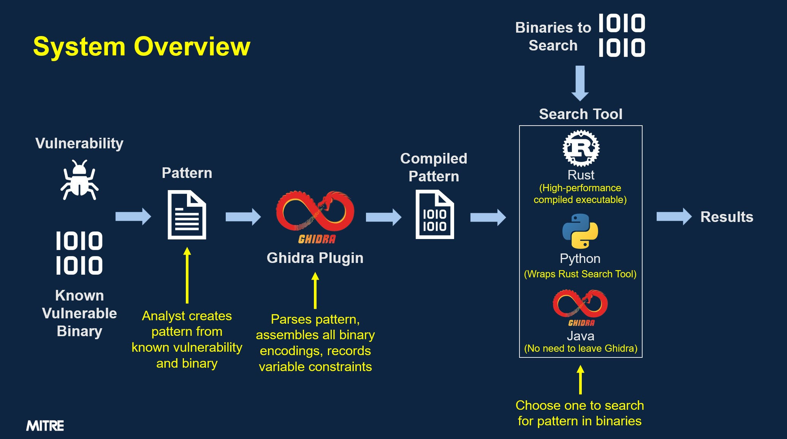

# PickledCanary

**Assembly-based binary pattern search!**



- Start with a known vulnerability and known vulnerable binary (or even better,
  binaries)
- Capture the vulnerability behavior in an [assembly-language based
  pattern](#pattern-language)
  - Use the [Pickled Canary VS Code Extension](#vs-code-extension) for syntax
    highlighting while writing a pattern
- Compile the pattern using our [Ghidra plugin](#ghidra-plugin)
  - This translates assembly into an [efficient binary
    format](#compiled-pattern-language) which encompasses all the possible
    binary encodings for each instruction
- Use our [Rust search tool](#rust-search-tool) to quickly find the pattern in
  many binaries!
  - Alternatively, use our [Python library](#python-library)

# Repository Structure

This repository contains all aspects of Pickled Canary including:

- The Ghidra Plugin - complete with a modified copy of Ghidra's assembler
- The Rust search tool - with Python bindings
- The Pickled Canary syntax highlighting plugin for VS Code

The location and installation instructions for each of these are described in
their respective sections below.

[Another repository](https://github.com/mitre/ghidra-pickled-canary) exists
which is a mirror of the Ghidra repo but containing a branch ("pickled-canary")
with Pickled Canary specific assembler modifications. This Ghidra fork does
_not_ currently contain all of the code required to run patterns nor the GUI
components of Pickled Canary; those are found here for now.

# Ghidra Plugin

## Download

Pre-built binaries are coming soon!

## Install

Install just like any other Ghidra extension:

1. Click `File` > `Install Extensions...`
1. Click the green plus sign and choose the downloaded file
1. Make sure the checkbox next to the new extension is checked
1. Restart Ghidra

## Run

The Pickled Canary Ghidra Plugin can be run via the [GUI](#gui) or via [Ghidra
Scripts](#ghidra-scripts).

### GUI

With the Pickled Canary Ghidra Plugin installed, a `Search` > `Pickled Canary Pattern` 
menu option is available.

> **Tip:** Selecting a range of instructions before opening the GUI will
> pre-populate those instructions into the pattern input box.


Enter a pattern on the left side of the GUI and then press `Ctl-Enter` or press
the  reload icon to compile and search
for the pattern. Results are listed in the table on the right side. Selecting a
result will jump to that address in the binary.

An existing pattern can be loaded into the GUI using the
 open icon, and an edited pattern
can be saved using the Save () or Save As
() icons.

The "Compiled" tab shows the JSON encoding of the currently compiled pattern
(use `Ctl-Enter` in the pattern editor to recompile the pattern). The "Save
Compiled Pattern As" () or "Save Compiled Pattern" () buttons can be used to save the compiled pattern to a
JSON file for use in the [Rust search tool](#rust-search-tool).

> **Tip:** Be sure to ensure the pattern has finished being compiled (no more
> progress bar shown under the "results" tab) before saving the compiled
> pattern.

### Ghidra Scripts

There are two included Ghidra scripts, both are available in Ghidra's script
manager:

> **Tip:** For both scripts, be sure your cursor is at a valid instruction
> address in the binary you want to compile your pattern against

1. `AssemblePattern` - Compiles a pattern for execution in the [Rust search
   tool](#rust-search-tool)
2. `AssembleAndRunPattern` - Compiles a pattern and executes it within Ghidra,
   highlighting matches.
   > **Tip:** These scripts can be copied/modified to behave differently (e.g.
   > to add bookmarks to each match rather than highlighting)

## Uninstall

To uninstall the current Pickled Canary extension (to install a new version, for
example):

1. Click `File` > `Install Extensions...`
1. Uncheck the box next to the "pc" extension
1. Restart Ghidra

If the extension still seems to be installed:

1. Ensure that Ghidra is not running (AT ALL)
1. Delete the "pc" folder (may have a variation of this name) in:
   - Windows: `C:\Users\USERNAME\.ghidra\GHIDRA_VERSION\Extensions\`
   - Linux: `~/.ghidra/GHIDRA_VERSION/Extensions/`

## Known Quirks

- To compile a pattern, be sure your "current address" is pointed at a memory
  address that is valid for the instructions in your pattern (e.g.: it's byte
  aligned and a valid code section)
  - The easiest way to do this is to simply click on an existing assembly
    instruction in your source binary.

## Ghidra Development Setup

1. Clone this repository
1. Open Eclipse (with Ghidra Dev Tools already installed)
1. In Eclipse click `GhidraDev` > `Import` > `Ghidra Module Source...`, chose
   the cloned copy of this repository and complete the wizard ensuring that your
   proper Ghidra installation is selected, and click `Finish`
1. Perform a debug launch of this project choosing to ignore errors in the
   project. These errors will go away as the project is built.

# Rust Search Tool

The Rust search tool consists of a library containing an Automata for processing
our [DFA](#compiled-pattern-language) and a wrapper binary which uses this
library to search one or more binary files for provided patterns.

This tool is currently called `treesearchtool`. This tool can be compiled with
the nightly rust compiler and more help on specific options is available by
running with `-h`.

**TODO:** More documentation about the specifics of this tool (once it's
finalized a bit more).

## Download

The pre-built `treesearchtool` may be downloaded from the Releases Page
(**Coming soon**). The search tool should be from the same release as was used
to compile your patterns.

# Python Library

The Pickled Canary Python library wraps a Rust library which exposes the core
search behavior of Pickled Canary.

## Usage

After installing (see below), simply do something like:

```python
from pickeled_canary import PatternOffsetResults
pattern_str = """{"tables":[],"steps":[{"type":"BYTE","value":116},{"type":"BYTE","value":102},{"type":"BYTE","value":116},{"type":"BYTE","value":112},{"type":"BYTE","value":95},{"type":"BYTE","value":114},{"type":"BYTE","value":120},{"type":"MATCH"}]}"""
test_data = b"aaatftp_rxddtftp_rxasdfasdf"

# Results is a list of offsets into the test_data binary where pattern_str matched
results = list(PatternOffsetResults.create_and_run(pattern_str, test_data))
```

If you don't want to pre-search the entire target binary, you can use the
following code to search one result at a time:

```python
from pickeled_canary import LazyPatternOffsetResults
pattern_str = """{"tables":[],"steps":[{"type":"BYTE","value":116},{"type":"BYTE","value":102},{"type":"BYTE","value":116},{"type":"BYTE","value":112},{"type":"BYTE","value":95},{"type":"BYTE","value":114},{"type":"BYTE","value":120},{"type":"MATCH"}]}"""
test_data = b"aaatftp_rxddtftp_rxasdfasdf"

lazy = LazyPatternOffsetResults.create_pattern(pattern_str, test_data)
first_result = next(lazy)
# Note the that the following line continues the search starting from the next byte after the offset of first_result
second_result = next(lazy)
# etc...
```

## Library installation

For non-development work on Linux you can download and install a pre-built wheel
matching your python version from the Releases Page (**Coming soon**).

You can try the "manylinux" version (from the same download location) if the
shorter-filename version doesn't work.

For Windows or Mac computers with "Apple Silicon", please follow the Development
instructions below.

## Development

Follow these instructions to be able to modify the Python code and use the most
current Rust code (in your workspace) from the python library.

> **NOTE:** You'll likely want to make sure you have a virtual environment of
> some sort set up and in use for this.

In the `search` directory run `pip install --editable .`

If you modify the Rust code, you'll need to re-run this pip command so the rust
is recompiled and re-linked against the python code (you do not need to do this
for modifications to the python code)

There are some simple test cases available by running `pytest` (assuming you
have pytest installed, else first run `pip install pytest`)

# VS Code Extension

A [VS Code](https://code.visualstudio.com/) extension has been created to
provide syntax highlighting for Pickled Canary patterns!

## Download

You can download the `.vsix` VS Code plugin from the Releases Page (**Coming
soon**).

## Install

In VS Code:

1. Open the command palette (`Ctrl`-`Shift`-`P` in Windows)
1. Type some part of "Extensions: Install from VSIX..." and choose this option
   when it appears.
1. Select the just-downloaded extension

## Use

Simply create or open a `.ptn` file to trigger Pickled Canary syntax
highlighting

## Uninstall

Before installing a new version, uninstall the current version by clicking
"uninstall" in the "Pickled Canary" entry in the VS Code Extensions list.

# Pattern Language

Examples of our pattern language are available in the `example_patterns`
directory in this project.

Leading whitespace is always ignored.

Use the [Pickled Canary VS Code Extension](#vs-code-extension) for syntax
highlighting while writing a pattern

## Comments

Lines starting with `;` are considered comments and no further processing is
performed on them.

## Metadata

Exactly one metadata block may be included in each pattern. This block is used
to document information about the pattern in a programmatically understandable
way.

The meta block starts with `` `META` `` alone on a line. The meta block ends
with another `` `META` `` alone on a line. Between these two lines is a JSON
object (e.g.: `{ "key" : "value", "key2": 2 }`). Additionally, there may be
comment lines (starting with `;`, as usual) which are removed before the meta
block is parsed as JSON.

## Instructions

Anything other than a [Command Block](#command-blocks) or [Comment](#comments)
is considered part of an instruction and is passed to Ghidra's autocomplete
functionality for assembly into binary. This is done line-by-line, possibly
including [some command blocks](#wildcards). Since Ghidra is processing the
provided assembly, be sure to use Ghidra's assembly syntax rather than what
might be found in another tool / the processor manual.

## Command Blocks

Command blocks are special commands to Pickled Canary which go beyond basic
assembly syntax to provide advanced searching capabilities.

All command blocks are surrounded by backtick characters; e.g.: `` `SOMETHING` ``

Command blocks should be included on their own line of the pattern (unless
otherwise specified).

### Specific Byte

Matches the given hex byte.

`` `=0xXX` `` where `XX` is the hex representation of a byte.

It can also match a given string's respective ASCII bytes. This can be done by
enclosing the string in double quotes.  
**Eg:** `` `"string 1"` `` attempts to match the bytes `0x73 0x74 0x72 0x69 0x6E
0x67 0x20 0x31`

### Masked Byte

ANDs the byte being examined with a given mask and compares the result to the
given byte value. Matches if the masked value matches the given byte value.

`` `&0xXX=0xYY` `` where `XX` is the mask and `YY` is the value to compare the
masked search byte against.

### Any Byte

Matches some number of bytes regardless of the bytes' value(s).

`` `ANY_BYTES{MIN,MAX,INTERVAL}` `` where `MIN` is the minimum number of bytes
to match and `MAX` is the maximum number of bytes to match (inclusive). `MIN`
and `MAX` can be the same number to match that specific number of bytes.  
`INTERVAL` is the amount of bytes stepped in each iteration. It is an
**optional** argument and the default value is 1.  
**Example:**  
`ANY_BYTES{2,5,1}` can also be written as `ANY_BYTES{2,5}`  
`ANY_BYTES{3,7,3}` steps through the range of (3,7) bytes in intervals of 3

### Or Blocks

Or blocks allows one of multiple choices to be matched.

Or options are evaluated in the order they are written in the pattern
(top-down). **Performance tip: Make sure your
most-likely-to-fail-or-match-quickly option is placed in the first option of an
or block**

Start the or block with `` `START_OR {` `` then include
[instructions](#instructions) or [command blocks](#command-blocks) as usual. At
the end of the first option, add a `` `} OR {` `` followed by the second set of
[instructions](#instructions) or [command blocks](#command-blocks). Another ``
`} OR {` `` can be added followed by an additional option, and so on. Finally,
end with an `` `} END_OR` ``.

For example, the following pattern matches `0xAA` followed by either `0xBB 0xCC`
or `0x01 0x02` (remember, leading whitespace does not matter):

```
`=0xAA`
`START_OR {`
  `=0xBB`
  `=0xCC`
`} OR {`
  `=0x01`
  `=0x02`
`} END_OR`
```

### Wildcards

Wildcards are used to indicate that more than one value (register, constant,
etc.) is allowable for a specific operand in an instruction.

Wildcards are included inline within an [instruction](#instructions) (see
examples below).

#### Wildcard Tokens

By default, Ghidra's instruction parser first groups the characters of an
instruction line into tokens, then attempts to match each token against a list
of possible "expected" tokens. These "expected" tokens are limited to the tokens
which are valid in this position within the current instruction.

We have worked with the Ghidra team to modify Ghidra's instruction parser to
think that a Pickled Canary "wildcard" token matches all the "expected" tokens
for the step where they are encountered. This means a single Pickled Canary
wildcard matches a single token.

To get an idea of what a token is Ghidra's autocompleter can be consulted. To
manually exercise the autocompleter: right-click on an instruction and choose
"patch instruction". From there you can edit the instruction and notice the
suggestions provided. Each suggestion represents a complete token (assuming you
haven't already partially typed the token; if so, only the remaining portion of
the token is shown).

#### Wildcard Field vs Scalar

A wildcard token can be either a "field" type or a "scalar" type. A "field" type
is replaced with a limited set of values, typically registers. A "scalar" type
is replaced with a number or a label representing a number (most likely in the
form of an address).

#### Wildcard Format

A Pickled Canary wildcard consists of a `NAME` and a `FILTER` in the following
format: `` `NAME/FILTER` `` where:

- `NAME` is an identifier (also occasionally called a "variable" or "label") for
  this wildcard and is used to save the value it represents.
  - Traditionally, this is something like `Q1`, but can also be something more
    descriptive.
  - If a name is repeated multiple times within the same pattern then all
    instances of that name must contain the same value (e.g.: register, number,
    etc) for the pattern to be a match.
    - Subsequent uses of a name MUST NOT specify a `FILTER`. In subsequent uses
      of a name, the `FILTER` value is reused from the first use of the name.
  - **TODO:** If `NAME` is `*`, no value will be saved by the rust code, nor
    will this `NAME` be matched against any other wildcards named `*`.
    - Actually, no extracting of the value will even be performed in rust,
      making this faster than if a unique name was specified.
      - A unique name may still be desirable if the value of the wildcard is
        important to extract.
    - It is still possible to specify a `FILTER` for a `*` wildcard as all
      possible completions are still enumerated because they may impact overall
      instruction encoding.
- `FILTER` is an expression which can take two forms:
  - A regular expression which must match for every acceptable token value of
    the wildcard.
    - When a filter is specified, Ghidra's "expected" tokens are filtered to
      only include tokens which match the `FILTER` regular expression.
    - Examples: 
      - `.*` to match any value
      - `r[0-9]` to match only registers `r0` through `r9`.
    - This type of filter does NOT apply on numeric values of a wildcard.
  - A bracketed, comma separated, set of ranges specifying valid numeric values
    for a wildcard.
    - Examples: 
      - `[0..10]` to match the numeric values 0 through 10.
      - `[-0x4..0x4,10..20]` to match the numeric values -4 through 4 or 10
      through 20. 
      - `[..]` to match all numeric values (but not register or other
      string-specified values).
  - NOTE: Starting in v0.1.0 filters must be separately specified for each
    instance of a wildcard. In other words, filters are no longer inherited from
    the first use of a given wildcard name. This is mostly important for search
    performance where it's likely best to specify filters as often as possible.
- Only `LABEL` is required (although it may be `*`).

#### Address Wildcards

If a wildcard's label starts with a `:` character and it's found to be used as a
scalar in an instruction Pickled Canary will attempt to compute the address
encoded by the scalar and report/match on that address.

For example, a MIPS `beq` instruction encodes a branch destination as its final
operand. To branch to eight instructions ahead of the `beq` instruction, a
binary `6` is encoded into the instruction. This is because MIPS specifies that
the branch destination is calculated as: `((Current branch instruction
address)+4)+((encoded value)*4)`. Given this, if the wildcard for the branch
destination operand is specified in Pickled Canary with a label starting with
`:` then Pickled Canary will calculate this label as an address yielding a value
of the `beq`'s address plus 28.

This feature can be used in conjunction with [Labels](#labels) to enforce a
constraint on the scalar value of a wildcard (e.g.: the destination of a
branch). For example, the following pattern will only match on `beq`
instructions which branch to a specific `sw` instruction which must occur within
40 bytes of the `beq`.

```
beq a0,zero,`:mylabel`
`ANY_BYTES{0,40}`
`mylabel:`
sw zero,0x104(s2)
```

> **_WARNING_**
>
> If the math required to compute the value of a label in an instruction
> involves computation based on an address (say the start or end address of the
> current instruction), PickledCanary may produce an unexpected result if the
> alignment of the matched bytes does not match the expected alignment of the
> instruction in an executing binary.
>
> For example, if an architecture assumes that an instruction will be four-byte
> aligned when executing but the instruction is found on another alignment by
> Pickled Canary (perhaps because of an odd-sized file-header proceeding the
> instruction), the calculation of the address referenced by that instruction
> may be incorrect.
>
> The only known way to avoid this issue is to ensure that the binary being
> searched is aligned in the file the same way it's expected to be running.

### Negative Lookaheads

> **This is an advanced feature which _severely_ impacts performance and may not
> be supported on all platforms. It is almost always possible to avoid using
> this feature!**

> The Ghidra plugin can parse and compile patterns with this feature. However,
> it cannot currently search for patterns with this feature.

Negative lookahead blocks prevent a match from being found if the pattern
elements inside them are found. They can be used to ensure that a value is not
followed by some other value.

Negative lookahead blocks start with a `` `NOT {` `` and end with a `` `}
END_NOT` ``

Negative lookaheads must not be used at the very start of a pattern.

Example: The following pattern matches `0x44` followed by any two bytes except
`0x08 0x34` (in that order) and finally there must be a `0x72`. Notice that the
`` `ANY_BYTES{2,2}` `` is needed to match the two bytes because the negative
lookahead block does not "consume" what it tries to match.

```
`=0x44`
`NOT {`
    `=0x8`
    `=0x34`
`} END_NOT`
`ANY_BYTES{2,2}`
`=0x72`
```

### Labels

`` `SOME_LABEL:` `` where `SOME_LABEL` is a user-specified label, the offset of
which will be reported in the pattern output.

> **Tip:** It's best to stick to alphanumeric labels with underscores to avoid
> collisions with other Pickled Canary commands (present or future).

# Compiled Pattern Language

Our compiled pattern language is a JSON encoding (future work: encode this as
binary) of a custom Deterministic Finite Automata (DFA) with steps roughly
mirroring the components of the [pattern language](#pattern-language) described
above. More information regarding this is available upon request.

# Copyright

Copyright (C) 2023 The MITRE Corporation All Rights Reserved
